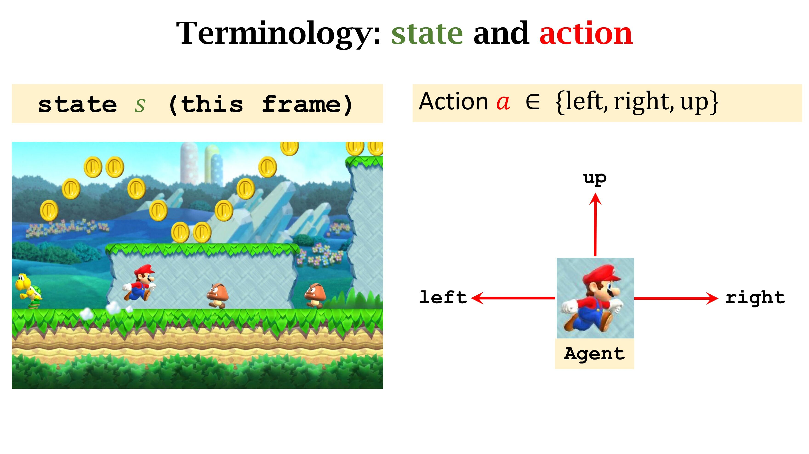
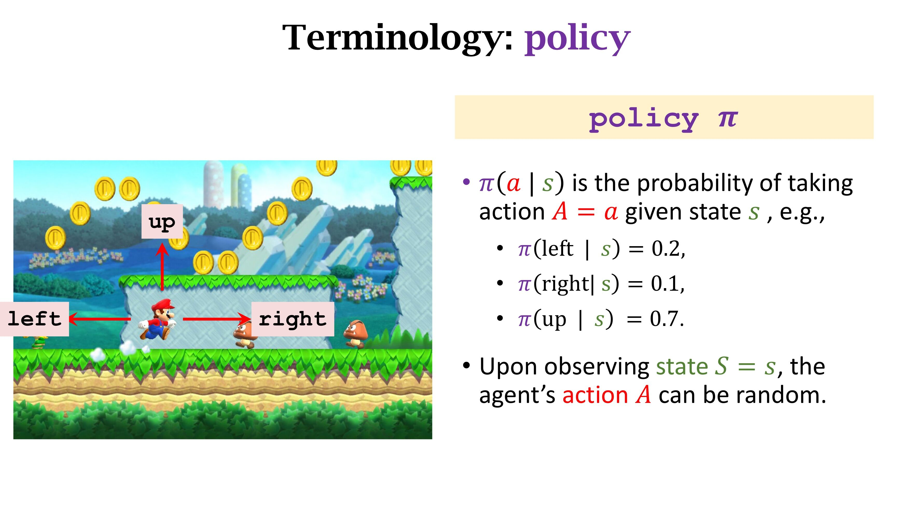
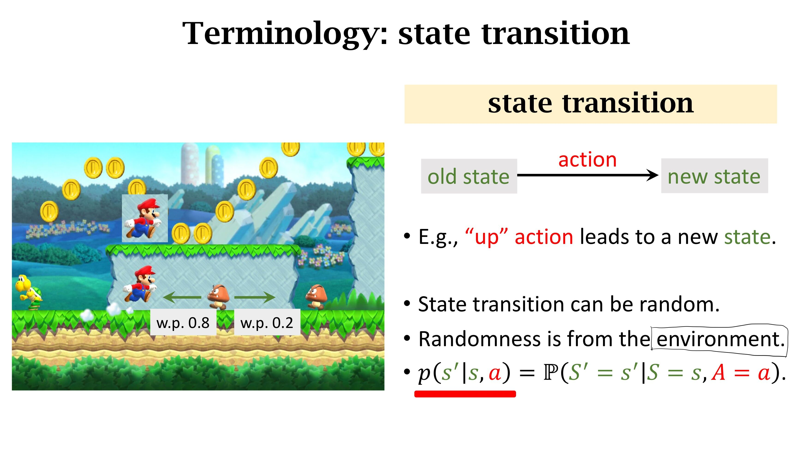
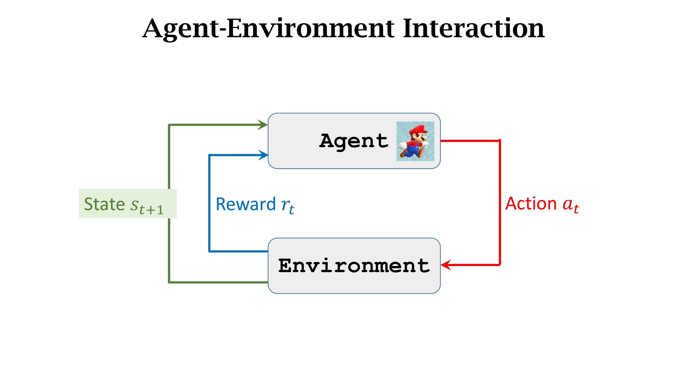
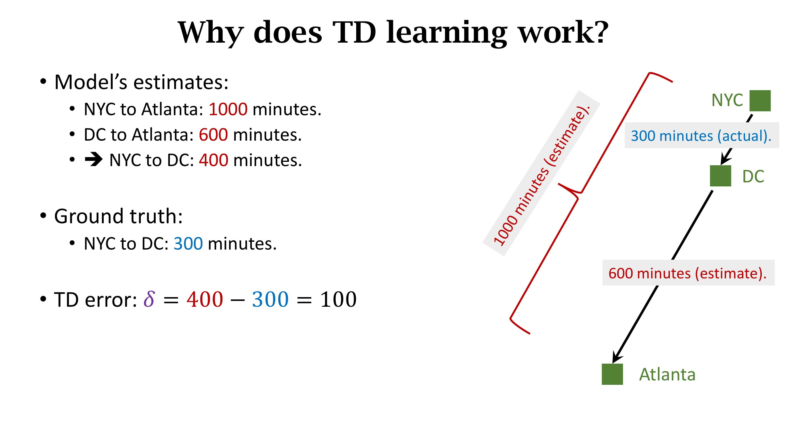
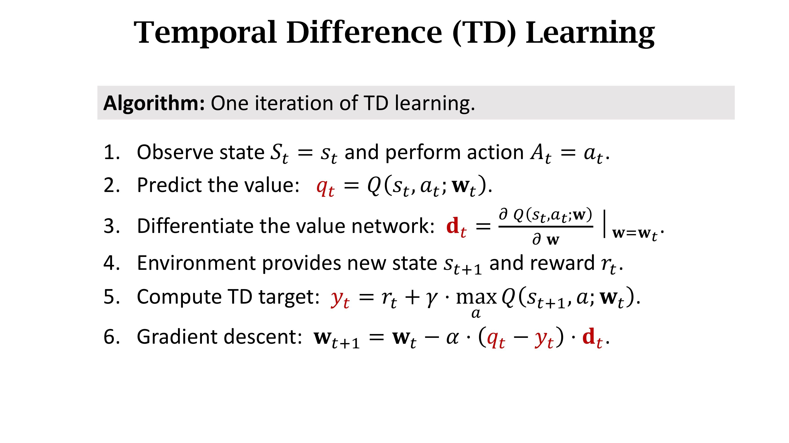

Learning notes of [Lectures given by Shusen Wang](https://www.youtube.com/watch?v=vmkRMvhCW5c&list=PLvOO0btloRnsiqM72G4Uid0UWljikENlU)

## Terminology

**Agent**: the component that makes the decision of what action to take

**Environment**: This is the world in which the agent lives, such as the real physical world, the game world, etc. 

**State**: The state is the agent's observation of the current world

**Action**: What the agent can do in a game. e.g. Go up, Go left, and Go right



**Reward**: After the agent makes a certain behavior, the environment's feedback to it

**Policy** 



**State Transition**:



Agent-Environment Interaction



**Discounted Return(aka Cumulative Discounted Future Reward)**: 
$$
U_t=\sum_{i=0}^{\infty}{\gamma^iR_{t+i}}
$$
$\gamma$ is called discounted factor, controlling how fast reward declines over time.

**Action-Value Function**
$$
Q_\pi\left(s,a\right)=E_\pi\left[U_t\middle| S=s,A=a\right]
$$
Given policy $\pi$, $Q_\pi\left(s,a\right)$ evaluates how good it is for an agent to pick action $a$ while being in state $s$

**Optimal Action-Value Function**
$$
{Q}^\ast\left(s,a\right)=\max_{\pi}\ Q_\pi\left(s,a\right)
$$
Given optimal policy, ${Q}^\ast\left(s,a\right)$ evaluates how good it is for an agent to pick action $a$ while being in state $s$

**State-Value Function**
$$
V_\pi\left(s\right)=E_a\left[Q_\pi\left(s,a\right)\right]=\sum_{a}{\pi\left(a\middle| s\right)}\ast Q_\pi\left(s,a\right)
$$
For fixed policy $\pi$, $V_\pi\left(s\right)$ evaluates how good the situation is in state $s$

$E_{S}[V_\pi\left(s\right)]$ evaluates how good the situation is in state $s$

## DQN

 [original paper](https://arxiv.org/pdf/1312.5602.pdf)

**Basic Idea**: using a NN to approximate Q function defined above, then choose the action which maximizes Q.

**TD target**: Suppose you drive a car from NYC to Atlanta, at first your Q function estimates that it will take 1000 minutes. And you spend 300 minutes driving from NYC to DC, and the Q function estimates that it will take you 600 minutes from DC to Atlanta. How could you update the parameters of the Q function with the distance from NYC to DC that you have covered? You can use TD learning: minimize the distance(e.g. use L2-loss) between ( NYC to DC + Q(DC to Atlanta) ) and Q(NYC to Atlanta)



**Algorithm**:



**Replay technique**: The actions will be saved for replay. When training, batch_size Transitions will be sampled from memory.

```python
import random
from collections import namedtuple, deque

'''
namedtuple: https://www.geeksforgeeks.org/namedtuple-in-python/
Transition - a named tuple representing a single transition in our environment.
It essentially maps (state, action) pairs to their (next_state, reward) result,
with the state being the screen difference image as described later on.
'''
Transition = namedtuple('Transition',
                        ('state', 'action', 'next_state', 'reward'))

'''
ReplayMemory - a cyclic buffer of bounded size that holds the transitions observed recently. 
It also implements a .sample() method for selecting a random batch of transitions for training.
'''
class ReplayMemory(object):

    def __init__(self, capacity):
        # deque: https://www.geeksforgeeks.org/deque-in-python/
        self.memory = deque([],maxlen=capacity)

    def push(self, *args):
        """Save a transition"""
        self.memory.append(Transition(*args))

    def sample(self, batch_size):
        return random.sample(self.memory, batch_size)

    def __len__(self):
        return len(self.memory)
    
memory=ReplayMemory(10000)
```

**How to compute TD target?** 
DQN: input-n_observations; output-n_actions, and the following two NNs are both DQN
policy_net: used to approximate Q function
target_net: approximate policy_net, which can also be regarded as approximation of Q function(used for [soft_update](https://arxiv.org/pdf/1509.02971.pdf), but I haven't delved into it)
TD-target = policy_net(action_actually_chosen, current_state) - ($\gamma*\max_{action}$ target_net(action, next_state)+reward_of_this_step), where $\gamma$ is the discount factor.
And from the memory, we can get (current_state,action_actually_chosen, next_state, reward_of_this_step)(check the code above)

**Soft update**:

```python
# TAU is the update rate of the target network
TAU = 0.005
target_net_state_dict = target_net.state_dict()
policy_net_state_dict = policy_net.state_dict()
for key in policy_net_state_dict:
    target_net_state_dict[key] = policy_net_state_dict[key] * TAU + target_net_state_dict[key] * (1 - TAU)
target_net.load_state_dict(target_net_state_dict)
```

**Exploration and Exploitation:**

```python
EPS_START = 0.9
EPS_END = 0.05
EPS_DECAY = 1000
steps_done = 0
def select_action(state):
    global steps_done
    # Return random number between 0.0 and 1.0:
    sample=random.random()
    eps_threshold=EPS_END+(EPS_START-EPS_END)* math.exp(-1.*steps_done/EPS_DECAY)
    steps_done+=1
    if sample>eps_threshold:
        with torch.no_grad():
            # t.max(1) will return largest column value of each row.
            # second column on max result is index of where max element was
            # found, so we pick action with the larger expected reward.
            return policy_net(state).max(1)[1].view(1,1)
    else:
        return torch.tensor([[env.action_space.sample()]],device=device,dtype=torch.long)
```

